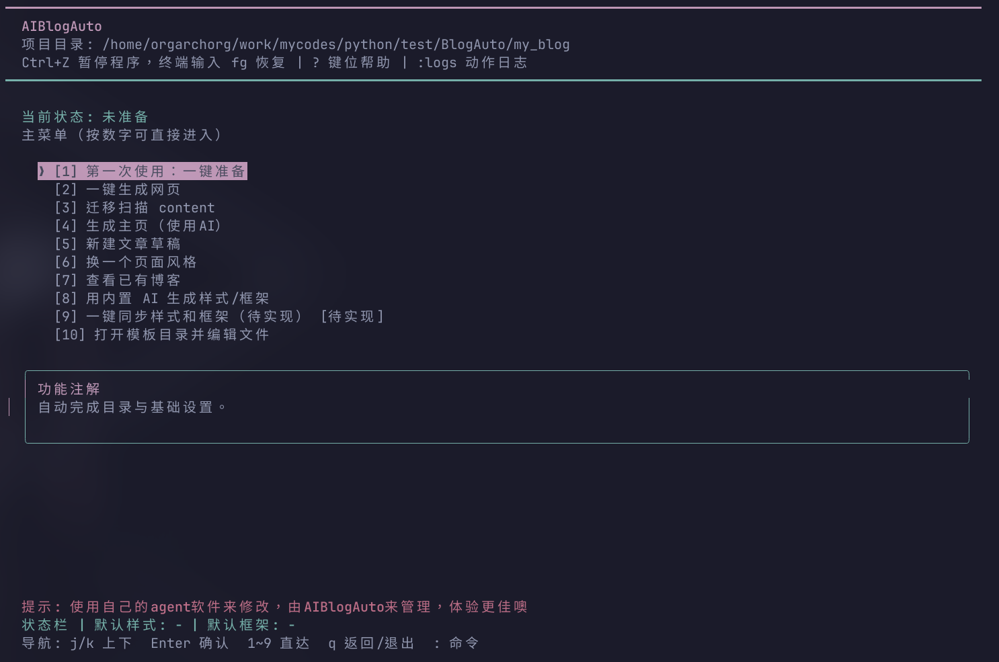
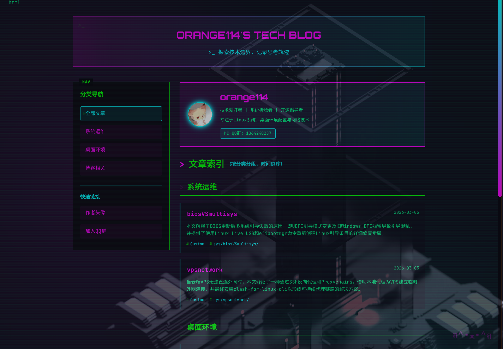

# AIBlogAuto
## 这是个vibecoding项目，代码一团糟，AI上下文管理做得啥都不是，随时可能出错。但加点手动挡还勉勉强强能用
注意，在使用本项目前请务必确保已备份自己的博客文件！！

<details>
  <summary><strong>目录导航（点击跳转）</strong></summary>
  <ul>
    <li><a href="#特性">特性</a></li>
    <li><a href="#安装">安装</a></li>
    <li><a href="#运行">运行</a></li>
    <li><a href="#键位说明">键位说明</a></li>
    <li><a href="#草稿文件说明">草稿文件说明</a></li>
    <li><a href="#deepseek-配置">DeepSeek 配置</a></li>
    <li><a href="#nerd-font">Nerd Font</a></li>
    <li><a href="#目录结构初始化后">目录结构（初始化后）</a></li>
    <li><a href="#简易教程">简易教程</a></li>
    <li><a href="#faq">FAQ</a></li>
  </ul>
</details>

以 AI 为特色的模块化博客生成器（Python + DeepSeek API），现代化全屏 TUI。




## 特性

- 现代化高颜值TUI
- AI为主题的静态博客站生成/管理工具
- vim操作模式
- 支持多家openai兼容格式的API,默认使用DeepSeek
- 模块化cli，高度可定制化

## 安装

```bash
git clone https://github.com/orangeTZ07/AIBlogAuto.git \
&& cd AIBlogAuto \
&& bash scripts/install.sh
```

## 运行

```bash
source .venv/bin/activate
aiblogauto
```

可选参数：

```bash
aiblogauto --workspace ./my_blog --no-browser
```

## 键位说明

- `j/k` 或方向键：上下移动
- `Enter`：确认
- `1~9`：按编号直达对应功能
- `q`：返回上一页（主菜单下为退出）
- `?`：显示键位帮助
- `:logs`：查看动作日志
- `Ctrl+Z`：暂停程序，终端输入 `fg` 恢复
- 输入页：`i` 进入输入模式，`Esc` 退出输入模式

## 草稿文件说明

- 文章正文文件：`my_blog.txt`
- 提示词文件：`prompt.txt`
- 根目录登记：`index.json`（记录文章位置，便于后续查找与构建）

## DeepSeek 配置

先配置环境变量：

```bash
export DEEPSEEK_API_KEY="your_key_here"
```

默认模型与地址：

- `deepseek-chat`
- `https://api.deepseek.com`

可在工作目录的 `blogauto.json` 修改：

- `ai_provider`
- `ai_model`
- `ai_base_url`

安全说明：

- API Key 不会写入项目配置文件（避免提交到 GitHub）。
- 建议用环境变量管理，如 `DEEPSEEK_API_KEY`、`OPENAI_API_KEY`、`ANTHROPIC_API_KEY`。
- 交互初始化时也可选择写入单独密钥文件（默认 `.blogauto-secrets.json`），程序会自动加入 `.gitignore`，但你仍需自行确保不外泄。
- 交互初始化时可选择 API Key 来源：环境变量或单独密钥文件。

预览提示：

- 如果浏览器预览调用失败，请自行将模板所在路径放入浏览器地址栏进行预览。

## Nerd Font

TUI 使用 Nerd Font 图标（如 `JetBrainsMono Nerd Font`）。

- 下载地址: <https://www.nerdfonts.com/font-downloads>
- 将终端字体切换为 Nerd Font 后可获得完整图标显示。(这里不会的可以问问AI)

## 目录结构（初始化后）

- `content/**/my_blog.txt`: 文章素材（支持自定义目录结构）
- `content/**/prompt.txt`: 对 AI 助手的页面生成提示词
- `content/styles/*.css`: 样式文件
- `content/frameworks/*.html`: 页面框架模板
- `prompts/*.prompt.txt`: AI 工具提示词
- `index.json`: 草稿位置索引（程序根目录）
- `content/index.html`: 网站主页（静态站点根）
- `changes/changes-*.html`: 提交后变动目录页

## 简易教程

将本程序放在你所期望的目录下(这里假设你没有使用参数进行启动)

<br>

- **注意**：一定要先对自己的博客目录或content目录进行备份。最好能够在“一键准备”时更换content目录到软件所在目录外，便于后期维护。

<br>

- 首先进行"一键准备"，配置你的默认样式、框架、内置agent等内容
  - 如果你选择了"\[1\] 读取环境变量（推荐）"，程序将从环境变量读取API KEY。该程序不会将API KEY自动加入到你的`bashrc`等配置文件中。
- 准备后，执行"用内置AI生成样式/框架"，获取你喜欢的样式/框架
- 之后"生成主页（使用AI）"，获得你的博客站主界面
- 然后"新建博客页"，创建你的文章
  - 如果你期望更换`文章prompt`，你可以在`cli.py`中用文本搜索找到提示词所在代码块并修改
- 如果你从前写了一些博客
  - 你可以把博客所在目录（一篇博客占一个目录）复制到`my_blog/content/`下
    - 你也可以把`content/`目录换到其他地方，但是目录名必须为`content/`
  - 然后运行"迁移扫描"，这会把你的博客页更新到`index.json`
  - 如果你想要自定义你的博客属性，你可以找到`my_blog/index.json`，自行修改
- 运行"查看已有博客"，判断是否成功写入文章
- 然后进行"生成主页（使用AI）"
- 自此你的静态博客站已生成完毕

<br>

- **注意**：如果你想要不依赖本软件来生成框架，请务必确保框架生成包含以下提示词：" - 生成/修改框架 HTML 时，强制“必须保留占位符: {title} {blog_name} {subtitle} {date} {content_html} {style_href}`。"

部署提示（以 GitHub Pages 为例）：

- 部署网页时请将 `content/*` 放在仓库根目录。
  - 可先在 content/ 目录下进行初始化git仓库
  - 然后将该git仓库连接到你的github page仓库
  - 使用本程序进行构建/修改后提交到你的仓库

## FAQ

- Q:我在生成主页后，浏览器里的文章链接都打不开是怎么回事？
  - A:生成主页后打开的预览界面是在previews目录下的一个预览html,里面的文章链接是基于previews的。如果你想预览你真正的主页，请将url中的previews替换为content, 文件名替换为index.html。如果本回答不够详细，你可以复制本回答和你的预览页面地址，一并投喂给AI，让AI详细作答。
